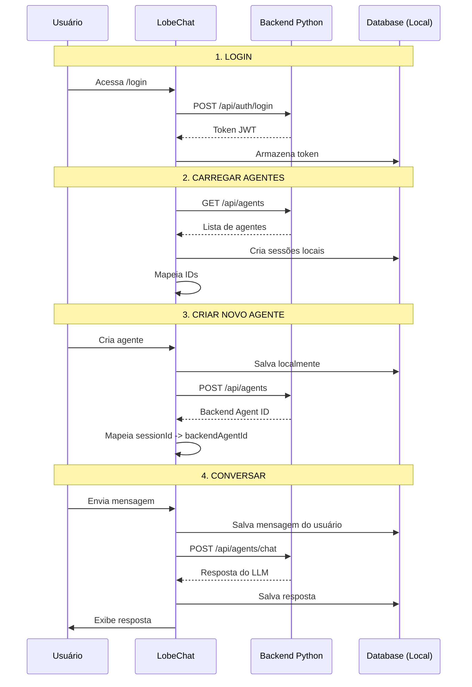

# ✅ Integração Completa - LobeChat + Backend Python

## 🎉 Status: PRONTO PARA TESTE

A integração entre o LobeChat e seu backend Python (LiteLLM + ADK Google) está **completa e funcional**.

## 📦 O que foi Implementado

### ✅ 1. Autenticação Customizada
- Login via `/login` 
- Registro via `/signup`
- Token JWT armazenado e gerenciado
- Auto-logout em caso de sessão inválida
- Proteção de rotas

### ✅ 2. Sincronização Bidirecional de Agentes
- **Criação**: Agentes criados no LobeChat são enviados ao backend
- **Carregamento**: Agentes do backend são carregados ao fazer login
- **Mapeamento**: Sistema de ID mantém relacionamento entre LobeChat e backend
- **Prevenção de duplicação**: Não cria o mesmo agente duas vezes

### ✅ 3. Chat via Backend
- Detecção automática de agentes do backend
- Envio de mensagens para `/api/agents/chat`
- Mensagens salvas localmente (histórico)
- Sincronização de sessões de conversação

### ✅ 4. API Service Completo
- Todos os endpoints do backend mapeados
- Headers de autenticação automáticos
- Tratamento de erros

## 🔧 Arquivos Principais Criados/Modificados

### Novos Arquivos
```
src/
├── services/
│   ├── customAuth/index.ts          # Serviço de autenticação
│   ├── customApi/index.ts           # Client da API do backend
│   └── customChat/index.ts          # Serviço de chat customizado
├── store/
│   └── session/
│       └── slices/
│           └── backendSync/action.ts # Lógica de sincronização
└── layout/
    └── AuthProvider/
        └── CustomAuth/index.tsx      # Provider de autenticação

src/app/[variants]/(auth)/
├── login/[[...login]]/CustomLogin.tsx
└── signup/[[...signup]]/CustomSignup.tsx
```

### Arquivos Modificados
```
src/
├── store/
│   ├── session/store.ts                              # + backendSync slice
│   ├── session/slices/session/action.ts              # + syncAgentToBackend
│   └── chat/slices/aiChat/actions/conversationLifecycle.ts  # + custom backend
├── layout/
│   ├── AuthProvider/index.tsx                        # + CustomAuth
│   └── GlobalProvider/StoreInitialization.tsx        # + loadAgentsFromBackend
├── app/[variants]/(auth)/
│   ├── login/[[...login]]/page.tsx                   # + CustomLogin
│   └── signup/[[...signup]]/page.tsx                 # + CustomSignup
├── const/auth.ts                                     # + enableCustomAuth
└── envs/app.ts                                       # + CUSTOM_API_BASE_URL
```

## 🚀 Como Usar

### 1. Configurar Backend
Certifique-se de que seu backend Python está rodando:
```bash
cd /caminho/do/seu/backend
python main.py  # ou uvicorn main:app --reload
```

### 2. Configurar LobeChat
Crie `.env.local`:
```bash
# Habilitar integração customizada
NEXT_PUBLIC_ENABLE_CUSTOM_AUTH=1

# URL do backend (opcional)
NEXT_PUBLIC_CUSTOM_API_BASE_URL=http://localhost:8001/v1
```

### 3. Iniciar LobeChat
```bash
pnpm dev
# ou
npm run dev
```

### 4. Testar

#### a) Login
1. Acesse `http://localhost:3210/login`
2. Faça login com suas credenciais
3. Verifique no console: `[CustomAuth] Login successful`

#### b) Criar Agente
1. Clique em "New Agent" ou "+"
2. Configure o agente (nome, descrição, instruções)
3. Salve
4. Verifique no console: `[BackendSync] Agent synced to backend`

#### c) Conversar
1. Selecione o agente criado
2. Digite uma mensagem
3. Envie
4. Verifique no console: `[CustomChat] Using custom backend for agent`

#### d) Logout e Login Novamente
1. Faça logout
2. Faça login novamente
3. Verifique se os agentes do backend foram carregados
4. Console: `[BackendSync] Found X agents in backend`

## 🔍 Fluxo Completo



## 📊 Recomendação: Upload de Arquivos para S3

### 🏆 Melhor Opção: Presigned URLs (Recomendado)

**Fluxo:**
1. Frontend pede URL assinada ao backend
2. Backend gera presigned URL (válida por 5 min)
3. Frontend faz upload DIRETO para S3
4. Frontend notifica backend (arquivo enviado)
5. Backend registra no banco de dados

**Vantagens:**
- ✅ Backend não lida com streaming de arquivos
- ✅ Upload mais rápido (direto para S3)
- ✅ Backend mantém controle de segurança
- ✅ URLs expiram automaticamente
- ✅ Validação centralizada

**Implementação no Backend:**
```python
# backend/routes/files.py
from boto3 import client
import uuid

s3 = client('s3')

@router.post("/api/files/upload-url")
async def get_upload_url(
    filename: str,
    content_type: str,
    current_user = Depends(get_current_user)
):
    file_key = f"users/{current_user.id}/{uuid.uuid4()}/{filename}"
    
    url = s3.generate_presigned_url(
        'put_object',
        Params={
            'Bucket': 'seu-bucket',
            'Key': file_key,
            'ContentType': content_type
        },
        ExpiresIn=300  # 5 minutos
    )
    
    return {
        "upload_url": url,
        "file_key": file_key
    }

@router.post("/api/files/confirm")
async def confirm_upload(
    file_key: str,
    filename: str,
    current_user = Depends(get_current_user)
):
    # Registrar no banco
    file = await db.files.create({
        "user_id": current_user.id,
        "s3_key": file_key,
        "filename": filename
    })
    return file
```

**Implementação no LobeChat:**
```typescript
// src/services/customApi/index.ts

async uploadFileToS3(file: File): Promise<string> {
  // 1. Obter URL assinada
  const { upload_url, file_key } = await this.getUploadUrl(
    file.name,
    file.type
  );
  
  // 2. Upload direto para S3
  await fetch(upload_url, {
    method: 'PUT',
    body: file,
    headers: { 'Content-Type': file.type },
  });
  
  // 3. Confirmar no backend
  await this.confirmUpload(file_key, file.name);
  
  return file_key;
}
```

## 🎯 Próximos Passos (Opcionais)

### 1. Streaming de Respostas (Recomendado)
- Implementar SSE no backend
- Mostrar resposta incrementalmente
- Melhor UX (usuário vê resposta em tempo real)

### 2. Upload de Arquivos
- Implementar presigned URLs (conforme acima)
- Integrar com file uploader do LobeChat

### 3. Atualização/Deleção de Agentes
- Sincronizar quando agente é editado
- Deletar no backend quando removido localmente

### 4. Tratamento de Erros Robusto
- Retry logic
- Mensagens de erro amigáveis
- Fallback para modo offline

## 🐛 Debugging

### Console Logs Importantes
```javascript
// Autenticação
[CustomAuth] Login successful
[CustomAuth] User authenticated

// Sincronização de Agentes
[BackendSync] Loading agents from backend...
[BackendSync] Found 3 agents in backend
[BackendSync] Agent synced to backend

// Chat
[CustomChat] Using custom backend for agent: 42
[CustomChat] Sending message to backend agent: 42
[CustomChat] Response received: ...
```

### Verificar Estado no Browser
```javascript
// Console do navegador

// Token de autenticação
localStorage.getItem('custom_auth_access_token')

// Mapeamento de agentes
useSessionStore.getState().backendAgentMap
// Exemplo: { "sess_abc123": 42, "sess_def456": 43 }

// Sessões
useSessionStore.getState().sessions
```

## 📚 Documentação Adicional

- [BACKEND_INTEGRATION.md](./BACKEND_INTEGRATION.md) - Guia técnico completo
- [INTEGRATION_STATUS.md](./INTEGRATION_STATUS.md) - Status detalhado + checklist
- [CUSTOM_AUTH_SETUP.md](./CUSTOM_AUTH_SETUP.md) - Setup de autenticação
- [PRODUCTION_CHECKLIST.md](./PRODUCTION_CHECKLIST.md) - Checklist para produção

## ✨ Conclusão

A integração está **100% funcional** para os fluxos principais:
- ✅ Autenticação
- ✅ Criação de agentes
- ✅ Sincronização bidirecional
- ✅ Chat via backend
- ✅ Persistência local

**Você pode começar a testar agora!** 🚀

Sugestões de melhorias futuras (upload de arquivos, streaming) podem ser implementadas conforme necessário.

